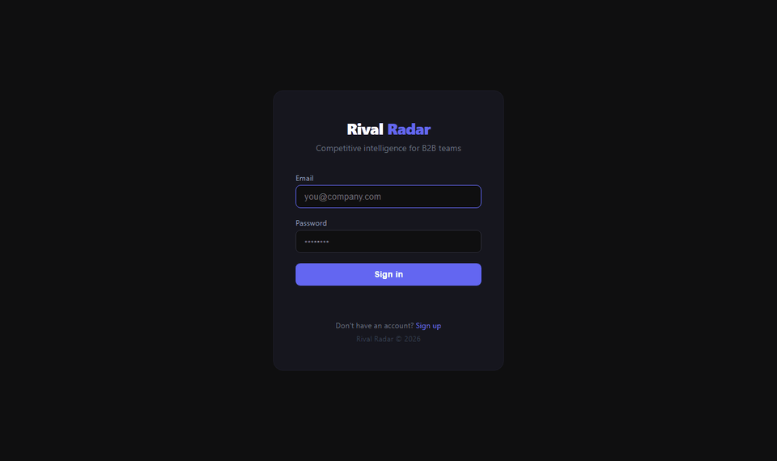

# Rival Radar

[](https://github.com/Akhilvallala1/rival-radar/actions/workflows/ci.yml)
[](https://github.com/Akhilvallala1/rival-radar/actions/workflows/deploy.yml)
[](https://www.python.org/)
[](LICENSE)

**Automated competitive intelligence for B2B SaaS teams.**

Track competitor websites, pricing pages, and blogs. Get a Claude-generated Slack brief every week summarising what changed and what it signals — no manual checking, no noise.

**Live demo:** https://rival-radar-247626835860.us-central1.run.app  
**API docs:** https://rival-radar-247626835860.us-central1.run.app/docs



---

## What you get

Add a competitor, hit **Run Now**, and in ~60 seconds you get a brief like this in Slack:

> **🎯 Rival Radar — Weekly Brief | August 18, 2026**
>
> **HubSpot** — Pricing page title tag updated from "CRM & Sales Software" to "Marketing Software Pricing" — a shift away from all-in-one framing toward marketing-specific buyers. Suggests possible unbundling of their platform narrative.
>
> **Recommended action:** Update battlecards for AEs in competitive deals. De-emphasise CRM comparison; lead with marketing workflow depth.

The analyst node reads the diff, interprets *what it signals*, and the writer turns it into something your sales team can actually use.

---

## How it works

```
Cron trigger (Monday 09:00) or manual Run Now
              │
              ▼
     ┌─────────────────────────────────────────┐
     │           LangGraph pipeline             │
     │                                          │
     │  scraper ──► analyst ──► writer ──► notifier
     │                                          │
     └─────────────────────────────────────────┘
          │              │              │
    async HTTP      Claude Sonnet    Slack
    + SHA-256       interprets       webhook
    diff vs DB      the signal
```

| Node | What it does |
|---|---|
| **scraper** | Async-fetches each URL with `aiohttp`, strips HTML, SHA-256 diffs against the last snapshot. Batch DB prefetch — 2 queries per run regardless of competitor count. |
| **analyst** | Feeds each changed excerpt to Claude with competitive-intelligence prompting. Returns structured `DiffEntry` objects. |
| **writer** | Claude synthesises all diffs into a concise, actionable Slack brief. |
| **notifier** | Posts the brief to your Slack channel via webhook. |

---

## Features

- **Multi-user SaaS** — email/password auth + Google OAuth, session cookies (`HttpOnly`, `SameSite=Lax`, `Secure`), per-user data isolation
- **SSRF protection** — `validate_url_safe()` blocks private IPs, link-local ranges, and reserved hostnames before any outbound fetch
- **Concurrent scheduling** — `ThreadPoolExecutor(max_workers=4)` runs competitors in parallel; one failure doesn't block others
- **Observability** — full Langfuse tracing on every LLM call, run history with timestamps and status in the dashboard
- **Rate limiting** — `slowapi` on auth endpoints, keyed by real client IP behind Cloud Run's load balancer
- **CI/CD** — GitHub Actions: ruff → mypy → pytest → Docker build → GCP Cloud Run deploy (deploy blocked until tests pass)

---

## Stack

| Layer | Tech |
|---|---|
| Agent framework | [LangGraph](https://github.com/langchain-ai/langgraph) |
| LLM | Claude Sonnet 4 via `langchain-anthropic` |
| API | FastAPI + uvicorn |
| Auth | `itsdangerous` sessions, `bcrypt`, Google OAuth 2.0 |
| Database | SQLAlchemy 2.0 — SQLite (dev) / Postgres (prod) |
| Scheduler | APScheduler — weekly cron, Monday 09:00 |
| Observability | Langfuse |
| CI/CD | GitHub Actions → GCP Artifact Registry → Cloud Run |
| Infra | Docker, Terraform-free (single Cloud Run service) |

---

## Quickstart

```bash
git clone https://github.com/Akhilvallala1/rival-radar
cd rival-radar
cp .env.example .env          # fill in ANTHROPIC_API_KEY + SLACK_WEBHOOK_URL
pip install -e ".[dev]"
```

**Scrape a URL and see the diff:**
```bash
python -m rival_radar scrape --url https://competitor.com/pricing --name "Acme Corp"
```

**Run the full AI pipeline:**
```bash
python -m rival_radar run --competitor-id 1
```

**Start the web dashboard:**
```bash
uvicorn rival_radar.api:app --reload
# open http://localhost:8000
```

---

## API

```bash
# Health check
curl http://localhost:8000/health

# Add a competitor
curl -X POST http://localhost:8000/competitors \
  -H "X-API-Key: changeme" \
  -H "Content-Type: application/json" \
  -d '{"name":"HubSpot","urls":["https://hubspot.com/pricing"],"cadence":"weekly"}'

# Trigger a run immediately
curl -X POST http://localhost:8000/competitors/1/run \
  -H "X-API-Key: changeme"

# View recent briefs
curl http://localhost:8000/runs -H "X-API-Key: changeme"
```

Interactive docs at `/docs` (Swagger UI).

---

## Development

```bash
ruff check src/ tests/    # lint
mypy src/                 # type check
pytest tests/ -v          # 95 tests across auth, multi-tenancy, SSRF, scheduler, integration
```

All three gates run on every PR via GitHub Actions before any deploy.

---

## Deployment

Every push to `master` builds a Docker image, pushes to GCP Artifact Registry, and deploys to Cloud Run — but only after CI passes.

**Required GitHub secrets:**

| Secret | Description |
|---|---|
| `GCP_PROJECT_ID` | GCP project ID |
| `GCP_CREDENTIALS` | Service account key JSON |
| `ANTHROPIC_API_KEY` | Anthropic API key |
| `SLACK_WEBHOOK_URL` | Slack incoming webhook |
| `DATABASE_URL` | Postgres connection string |
| `SECRET_KEY` | Session signing key (random 32+ char string) |
| `LANGFUSE_PUBLIC_KEY` | Langfuse public key *(optional)* |
| `LANGFUSE_SECRET_KEY` | Langfuse secret key *(optional)* |

---

## Roadmap

- [x] **Tier enforcement** — starter (2 competitors, weekly), pro (10, daily), team (unlimited, hourly); enforced server-side on every request
- [x] **G2 review monitoring** — structured extraction of rating, review count, and recent reviews via JSON-LD + CSS fallback; hashes structured data so cosmetic G2 page changes don't trigger false positives
- [x] **Keyword alerts** — instant Slack ping when a tracked keyword appears in a scrape diff; API: `POST/GET /competitors/{id}/alerts`, `DELETE /alerts/{id}`

---

## License

MIT
